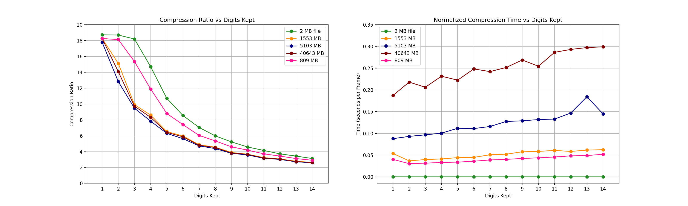

# VTJ1 Trajectory Compression Format

## UltraEncode / UltraDecode

This repository provides a **high‑performance trajectory compression system** designed for large molecular or particle simulations such as **oxDNA**. The system converts large plaintext trajectory files (`.dat`) into a compact binary representation (`.bin`) while preserving extremely high numerical precision.

The compression pipeline consists of two programs:

- **encode_trj** — converts plaintext trajectories (`.dat`) into compressed binary (`.bin`)
- **decode_trj** — reconstructs the original trajectory text from the binary format

The binary format used by this system is called **VTJ1 (Trajectory v1)**.

---

# Overview

Simulation trajectory files often become extremely large because they store:

- floating‑point particle coordinates
- simulation time values
- simulation box vectors
- energy values
- particle state values
- repeated structural data across frames

Standard trajectory formats store numbers as **ASCII text**, which is inefficient both in storage and parsing performance.

The **VTJ1 format** significantly reduces file size by combining several compression techniques specifically designed for simulation trajectories:

1. Fixed‑point quantization
2. Delta compression
3. Predictive coding
4. Variable‑length integer encoding
5. Global metadata storage

Because molecular simulations typically produce **smooth particle motion between frames**, these techniques achieve very high compression ratios while maintaining precise numerical reconstruction.

---

# Compression Pipeline

The encoder performs the following steps when converting a trajectory:

1. Parse the plaintext trajectory file.
2. Convert floating‑point values to fixed‑point integers.
3. Predict the next frame using previous frames.
4. Store only the difference from the prediction.
5. Encode integers using variable‑length encoding.
6. Store global metadata once in a compact header.

The decoder performs the exact inverse operations to reconstruct the trajectory.

---

# Fixed‑Point Quantization

All floating‑point values are converted into integers using a fixed decimal precision.

q = round(value × 10^scale_digits)

Example:

| Original Value | scale_digits | Stored Integer |
|---------------|-------------|---------------|
| 0.123456 | 6 | 123456 |
| 0.12345678901234 | 14 | 12345678901234 |

This transformation allows floating‑point values to be stored as integers while maintaining controlled numerical precision.

Typical precision settings:

| scale_digits | Precision |
|--------------|----------|
| 6 | 1e‑6 |
| 10 | 1e‑10 |
| 14 | 1e‑14 |

Higher precision slightly increases the encoded size but improves reconstruction accuracy.

---

# Frame Prediction

Particle values typically change slowly between frames. The encoder exploits this by predicting each frame from previous frames and storing only the residual difference.

## Frame 0

The first frame is stored directly:

stored = q

## Frame 1

The second frame stores the difference from frame 0:

delta = q₁ − q₀

## Frame ≥ 2

Later frames use **second‑order prediction**:

prediction = 2 × q_prev − q_prev2

delta = q − prediction

This captures constant‑velocity motion and dramatically reduces the magnitude of stored values.

---

# Energy Compression

Energy values are also delta‑encoded.

Frame 0 stores absolute values:

E₀

Subsequent frames store differences:

delta = E_k − E_{k−1}

Because energies change slowly between frames, these differences remain small integers and compress efficiently.

---

# Variable‑Length Integer Encoding

All integer values are encoded using **signed LEB128 variable‑length encoding**.

This encoding allows small integers to occupy fewer bytes.

Typical storage sizes:

| Value Range | Storage |
|-------------|---------|
| -64..63 | 1 byte |
| -8192..8191 | 2 bytes |
| larger values | more bytes |

Since prediction keeps most deltas small, the majority of stored values require only **1–2 bytes**.

---

# Global Metadata

Information that remains constant across frames is stored once in the header instead of being repeated.

The metadata includes:

- simulation box vectors
- timestep spacing
- number of particle rows
- number of columns per row
- number of energy values
- quantization precision

This greatly reduces redundant data storage.

---

# VTJ1 Binary Layout

Each VTJ1 file begins with a fixed‑size header.

Header structure:

magic:        4 bytes   "VTJ1"
version:      uint32
scale_digits: uint32
n_rows:       uint32
n_cols:       uint32
n_b:          uint32
box_values:   MAX_BVALS × int64
t0_q:         int64
dt_q:         int64
n_E:          uint32

After the header, the compressed frames follow.

Each frame contains:

- energy deltas
- body deltas (stored column‑wise)

All values are encoded using variable‑length integers.

---

# Decoding Pipeline

The decoder reconstructs the trajectory by performing the inverse operations:

1. Read the VTJ1 header
2. Allocate memory buffers
3. Read variable‑length integers
4. Reconstruct energies using cumulative deltas
5. Reconstruct body values using the predictor
6. Convert fixed‑point integers back to floating‑point values

value = integer / 10^scale_digits

The decoded frames are then written back to plaintext trajectory format.

---

# Building the Programs

The repository includes a **Makefile** that simplifies compilation of the encoder and decoder.

To build both programs:

make

This compiles:

- encode_trj
- decode_trj

Compilation uses the following optimization flags:

- `-O3`
- `-march=native`
- `-ffast-math`
- `-funroll-loops`
- `-std=c11`

These flags maximize performance for trajectory processing workloads.

To remove compiled binaries:

make clean

---

# Usage

## Encode a Trajectory

./encode_trj input.dat output.bin n_cols scale_digits

Parameters:

| Parameter | Description |
|----------|-------------|
| input.dat | plaintext trajectory |
| output.bin | compressed binary output |
| n_cols | number of columns per particle row |
| scale_digits | decimal precision retained |

Example:

./encode_trj traj.dat traj.bin 15 14

---

## Decode a Trajectory

./decode_trj input.bin output.dat

Example:

./decode_trj traj.bin traj_reconstructed.dat

---

# Precision and Losslessness

The compression scheme is **lossless with respect to the quantized integer representation**.

If the original trajectory values contain no more than `scale_digits` decimal places, reconstruction will match the original values exactly.

Otherwise the maximum numerical error is bounded by:

±0.5 × 10^(−scale_digits)

For example, with `scale_digits = 14`, the error is extremely small and typically negligible for simulation analysis.

---

# Advantages

- Very high compression ratio for trajectory data
- Fast encoding and decoding
- Minimal memory overhead
- Simple and deterministic binary format
- Scales to extremely large simulations

---

# Limitations

The current VTJ1 format assumes:

- simulation box vectors remain constant
- number of columns per row is fixed
- number of energy values is constant
- precision is limited by the chosen `scale_digits`

---

# Intended Use

The VTJ1 compression format is designed for:

- molecular dynamics trajectories
- oxDNA simulations
- particle systems with smooth motion
- extremely large simulation datasets

It is particularly effective when trajectories contain many frames with small incremental motion.

---

# Benchmarks

## Encoding Benchmark

The benchmark figure included in this repository summarizes encoder performance across several trajectory sizes.

The datasets used in the benchmark are summarized below.

| Original Size (MB) | Frames | Particles |
|--------------------|--------|-----------|
| 2 | 1200 | 3 |
| 809 | 200 | 15449 |
| 1553 | 300 | 19499 |
| 5103 | 1000 | 19499 |
| 40643 | 7175 | 21649 |

The benchmark compares:

* Compression Ratio vs Precision: Lower precision (fewer digits) increases compression efficiency, while higher precision preserves more numerical detail.
* Encoding Time per Frame: Encoding time is normalized by frame count, allowing fair comparison between datasets with different trajectory lengths.

These results demonstrate the tradeoff between precision, compression efficiency, and computational cost across a wide range of simulation sizes.

